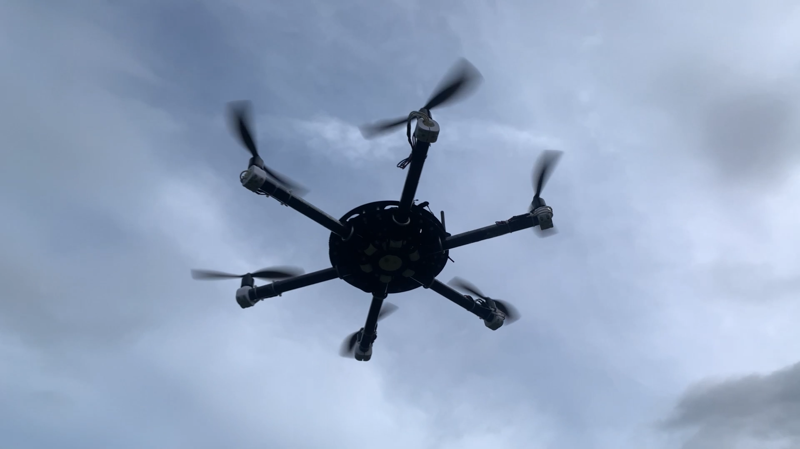

# Folding Carbon Fiber Hexacopter

A scratch-built hexacopter with folding carbon fiber arms, positive buoyancy for
over-water recovery, and a backpack-portable transport case. Built around
salvaged 3DR and mRobotics hardware with a modern ESC and radio stack, running
ArduPilot.

**▶ [Build video and flight footage](https://youtu.be/24VfEYux5ME)**



---

## Overview

This project started as a box of used 3DR and Pixhawk parts and grew into a
complete airframe designed around three goals:

1. **Fold for transport.** Each arm pivots on a single bolt and clamps with a
   U-bolt and thumb nuts — no tools required to deploy or stow.
2. **Float after a water landing.** Foam-filled arm tubes and printed
   lightweight-PLA floats keep the aircraft on the surface long enough to
   retrieve it.
3. **Carry it anywhere.** The folded aircraft rides in a sealed drum case with
   backpack straps.

Everything structural is either carbon fiber cut in-house or 3D printed. The
CAD, bill of materials, ArduPilot parameters, and supporting code are all in
this repository.

---

## Specifications

| | |
|---|---|
| Configuration | Hexacopter, X layout |
| Flying weight | **4.83 lb (2.19 kg)** |
| Deployed span | **36.125" prop tip to prop tip** (26.125" motor to motor) |
| Folded envelope | **9.375" diameter × 21.0" tall** |
| Total buoyancy (all floats) | 7.22 lb |
| Propellers | 6 × APC 10×4.7 SFP |
| Battery | 3S LiPo, 5600 mAh (MaxAmps 2P) |
| Thrust-to-weight | ~1.9 : 1 |
| Hover throttle | 51–54 % |
| Frame material | 1/16" carbon fiber plate, 1" OD carbon tube arms |
| Printed parts | PETG (structural), LW-PLA (floats) |
| Autopilot | mRo Control Zero Classic, ArduCopter 4.6.3 |
| Estimated build cost | **$1,382** (see [Cost](#cost) for what this includes) |

### Dimensions

| | Deployed | Folded |
|---|---|---|
| Max diameter | 36.125" (prop tip to prop tip) | **9.375"** |
| Motor centers | 26.125" | — |
| Height | 5.75" (including antennas) | 21.0" with props<br>16.0" without props |

Folding reduces maximum width by nearly 4×. In the stowed position the props
fold parallel to the arms, which accounts for the 5" difference between the
two folded heights.

---

## Measured Performance

All figures below are pulled from actual flight logs, not estimates.

### Speed and range

| Metric | Value |
|---|---|
| Max speed (manual) | **19.4 m/s — 43.3 mph** |
| Max speed (autonomous) | 10.0 m/s — limited by `WPNAV_SPEED` |
| Cruise speed, typical mission | 6.7 m/s average while moving |
| Max demonstrated distance from launch | **421 m (1381 ft)** |
| Longest logged mission | 1273 m ground track in 5.2 min |
| Max altitude flown | 114.6 m (376 ft) |

Top speed is limited by `ANGLE_MAX` (30°) and motor saturation, not by drag —
the aircraft was commanding maximum lean angle and maximum motor output
simultaneously during the fastest runs.

### Power and endurance

| Metric | Value |
|---|---|
| Hover current | ~33 A |
| Peak current observed | 63 A |
| Endurance to low-battery failsafe | ~8–9 min |
| Energy consumed, 5.2 min mission | 32.4 Wh (2863 mAh, 51 % of pack) |
| Efficiency, full mission | 39.3 m/Wh — 129 ft/Wh — 40.9 Wh/mile |
| Efficiency, cruise only (>7 m/s) | 90.3 m/Wh — 296 ft/Wh — 17.8 Wh/mile |

Cruising is roughly 2.3× more efficient per unit distance than a
waypoint-heavy mission, because hovering costs nearly the same power as
forward flight while covering no ground.

### Control performance

Attitude tracking error from a full autonomous mission after tuning:

| Axis | Mean error | 99th percentile | Max |
|---|---|---|---|
| Roll | **0.23°** | 1.43° | 2.99° |
| Pitch | **0.15°** | 1.33° | 3.04° |
| Yaw | 1.21° | 7.34° | 10.28° |

---

## Design Features

### Folding arms

Each arm is a 1" OD × 0.875" ID roll-wrapped carbon tube that pivots on a
single 1/4"-20 bolt through a printed PETG hinge. An aluminum U-bolt and two
thumb nuts clamp the tube against the frame plate to lock it deployed. A
printed arm stabilizer adds rigidity at the joint.

No tools are needed to fold or deploy the aircraft.

### Buoyancy — recovery, not survival

**This is not a waterproof aircraft.** None of the electronics are in sealed
enclosures, and a water landing will almost certainly destroy the flight
controller, ESCs, motors, and radios. The floats exist for exactly one reason:
to keep the airframe on the surface so it can be retrieved rather than lost to
the bottom.

Flying weight is 4.83 lb; total buoyancy with all floats fitted is 7.22 lb,
giving a healthy positive margin.

| Source | Buoyancy (lb) |
|---|---|
| Arms (foam-filled tubes, all 6) | 1.87 |
| Frame assembly | 0.33 |
| Central float | 0.21 |
| "Pizza slice" floats (5) | 1.00 |
| Battery displacement | 0.44 |
| Auxiliary EPS foam float | 3.37 |
| **Total** | **7.22** |

The auxiliary EPS float is fitted only for over-water flights. The printed
floats use lightweight PLA shells with foam interiors.

### Transport case

The folded aircraft rides in a 14-gallon HDPE lab-pack drum with a metal
lever-lock ring, fitted with **backpack straps**. That makes it practical to
hike a fair distance to a launch site, and the sealed drum is equally happy
being shipped or thrown in a truck bed.

Custom foam layers (waterjet-cut, sliced into smaller pieces for
manufacturability) support the body, motor arms, and prop tips. Printed prop
protectors guide the blades into their foam slots during packing.

---

## Hardware

Full details, part numbers, weights, costs, and sourcing links are in
[`Final BOM.ods`](Final%20BOM.ods) (also provided as `.xlsx`).

### Propulsion

| Item | Part | Qty |
|---|---|---|
| Motor | 3DR brushless, salvaged (12N14P) | 6 |
| ESC | Lumenier Razor Pro F4 45 A 2–6S **AM32** | 6 |
| Propeller | APC 10×4.7 SFP slow-flyer pusher | 6 |
| Battery (main) | MaxAmps 3S 5600 mAh 2P | 1 |
| Battery (alt) | Lectron Pro 3S 5200 mAh 50C | 1 |

ESCs run **DShot600**. Each has a 220 µF capacitor across the battery input.

### Avionics

| Item | Part |
|---|---|
| Flight controller | mRo Control Zero Classic (STM32F7) |
| Firmware | ArduCopter 4.6.3 |
| Power module | mRo ACSP4 — 120 A sensing, 5 V / 12 V BEC |
| GPS / compass | u-blox M8N with HMC5883 on printed mast |
| Telemetry | 915 MHz SiK-style, air + ground pair |
| RC receiver | RadioMaster RP4TD ExpressLRS 2.4 GHz diversity |
| RC transmitter | RadioMaster Pocket ELRS M2 |

### FPV

| Item | Part |
|---|---|
| VTX | SpeedyBee TX800, 25–800 mW 5.8 GHz |
| Camera | Caddx Baby Ratel 2, 1200 TVL |
| Goggles | Eachine EV800D diversity with DVR |

### Structure

| Item | Source |
|---|---|
| Frame plates (upper, middle, lower) | 1/16" DragonPlate EconomyPlate, cut in-house |
| Frame gussets (12) | Same stock |
| Arms (6) | DragonPlate 0.875" × 1.0" × 24" roll-wrapped twill tube |
| Arm pivots, motor mounts, stabilizers | 3D printed PETG |
| Floats, camera mount, GPS pedestal, antenna mount | 3D printed LW-PLA / PETG |
| Fasteners | McMaster-Carr aluminum, 4-40 / 6-32 / 1/4"-20 |

Carbon plate was cut with 1/16" DLC-coated carbide end mills.

---

## ArduPilot Configuration

Full parameter file: [`Ardupilot Parameters.params`](Ardupilot%20Parameters.params)

### Frame and motors

```
FRAME_CLASS       = 2        # Hexacopter
FRAME_TYPE        = 1        # X
MOT_PWM_TYPE      = 6        # DShot600
MOT_THST_EXPO     = 0.65
MOT_SPIN_ARM      = 0.10
MOT_SPIN_MIN      = 0.15
MOT_SPIN_MAX      = 0.95
SERVO_BLH_POLES   = 14
```

### Attitude tune

Roll and pitch gains came from a completed AutoTune run on the roll axis and
were copied to pitch (the airframe is symmetric). Yaw was set manually — see
[Known Issues](#known-issues-and-future-work).

```
ATC_RAT_RLL_P     = 0.522     ATC_RAT_PIT_P     = 0.522
ATC_RAT_RLL_I     = 0.522     ATC_RAT_PIT_I     = 0.522
ATC_RAT_RLL_D     = 0.0213    ATC_RAT_PIT_D     = 0.0213
ATC_ANG_RLL_P     = 13.062    ATC_ANG_PIT_P     = 13.062
ATC_ACCEL_R_MAX   = 82000     ATC_ACCEL_P_MAX   = 82000

ATC_RAT_YAW_P     = 0.45
ATC_RAT_YAW_I     = 0.045
ATC_RAT_YAW_D     = 0
ATC_ANG_YAW_P     = 4.5
ATC_ACCEL_Y_MAX   = 27000
```

These gains are roughly 4× the ArduPilot defaults. That is expected for a
heavy, high-inertia airframe swinging 10" props — each unit of motor output
produces a smaller, slower rotational response than on a small quad, so the
controller needs more gain to track the same command.

### Battery monitoring

Both voltage and capacity failsafes are configured. The current sensor was
calibrated empirically against measured pack consumption.

```
BATT_MONITOR      = 4         # analog voltage + current
BATT_VOLT_MULT    = 13.739
BATT_AMP_PERVLT   = 45.1      # calibrated, not the datasheet default
BATT_CAPACITY     = 5600
BATT_LOW_VOLT     = 10.4      # RTL
BATT_CRT_VOLT     = 10.0      # LAND
BATT_LOW_MAH      = 1120      # RTL at 20 % remaining
BATT_CRT_MAH      = 560       # LAND at 10 % remaining
```

### Radio link

ExpressLRS over CRSF on SERIAL5 (UART8):

```
SERIAL5_PROTOCOL  = 23        # RCIN
RC_PROTOCOLS      = 512       # CRSF only
RC_OPTIONS        = 8736      # bit 13 (ELRS 420k), bit 9 (suppress rate msg)
RSSI_TYPE         = 3         # RSSI from CRSF link
```

### Navigation and safety

```
RTL_ALT           = 2000      # 20 m — clears typical central Texas tree line
WPNAV_SPEED       = 1000      # 10 m/s
WPNAV_SPEED_UP    = 250
WPNAV_SPEED_DN    = 150
ANGLE_MAX         = 3000      # 30°
RC9_OPTION        = 4         # RTL on aux switch
ARMING_CHECK      = 13822

FENCE_TYPE        = 7         # polygon + cylinder + max altitude
FENCE_RADIUS      = 300
FENCE_ALT_MAX     = 100
FENCE_ACTION      = 1         # RTL, fallback Land
```

---

## Cost

**$1,382.26** total, but that number is a deliberate over-estimate. It counts:

- Whole sheets, tubes, and filament spools of raw stock rather than the
  fraction actually consumed
- Full fastener packs where only a few pieces are needed
- Ground equipment that never flies — transmitter, FPV goggles, ground
  telemetry radio, transport case and foam
- Tooling (carbide end mills)

Actual spend on the flying aircraft alone is substantially lower. Several
major components (motors, flight controller, GPS, power module, telemetry
radios) were sourced used from eBay.

---

## Repository Contents

```
├── README.md
├── CAD/                              # source CAD, STEP exports, STLs
├── Drone Weight Optimizer/           # battery selection tool + its own README
├── prop dyno data/
│   └── hex drone motor 3s/raw data/  # dynamometer sweeps feeding the optimizer
├── Ardupilot Parameters.params       # full parameter dump
├── Final BOM.ods                     # bill of materials (LibreOffice)
└── Final BOM excel.xlsx              # same, Excel format
```

### Drone Weight Optimizer

[`Drone Weight Optimizer/`](Drone%20Weight%20Optimizer) contains a Python tool
that picks the LiPo pack giving the longest hover time without violating
thrust or current limits. It fits a power-law curve (`I = a · T^b`) to the
propeller dynamometer data in [`prop dyno data/`](prop%20dyno%20data), predicts
hover current for each candidate battery, and ranks them while flagging any
that fail a thrust-to-weight or continuous-discharge check.

Its recommendation for this airframe was the **MaxAmps 5600 mAh 3S2P** — the
pack actually installed. Predicted hover draw was 29.6 A for 11.4 minutes;
measured flight data gives 33.1 A and roughly 10 minutes to full discharge.
The ~12 % optimism is consistent with the tool's stated simplifications, which
ignore voltage sag and assume pure hover.

See the README inside that directory for inputs, configuration, and usage.

---

## Build Notes and Lessons Learned

A few things that cost real time during this build, recorded here in case
they save someone else the trouble.

### ESC current limits

The Lumenier ESCs shipped with a current limit slider that read **"DISABLED"**
at its maximum position, but behaved as though the limit were near zero — the
motors would spin up unloaded and then refuse to accelerate past roughly 30 %
throttle with a prop installed. Moving the slider one notch off "DISABLED" to
a numerically high value (200 A) resolved it completely.

If your motors plateau under load but reach full RPM with props off, check
this before suspecting anything else.

### Compass placement is not enough on its own

An external compass on a mast still picked up severe interference once the
battery leads were repositioned near it. Field magnitude collapsed from
383 mGauss on the ground to 187 mGauss in flight — a ~350 mGauss disturbance
appearing the instant the motors drew flight current, large enough to swamp
Earth's field and corrupt the heading estimate.

The fix was routing the battery leads away from the mast and keeping the
positive and negative conductors paired. Paired leads carry equal and
opposite current, so their fields largely cancel and fall off as 1/r² instead
of 1/r.

**Verification method:** compare field magnitude with motors off versus
running. A healthy install shows almost no change. Anything more than ~10 %
warrants investigation.

### Motor mount fasteners

Two motor mounts worked loose in flight and rotated far enough to tilt the
thrust vectors. Because a tilted motor's tangential thrust component acts
through the full arm length — a much longer lever than the prop reaction
torque used for yaw control — even a few degrees of tilt produced a yaw
disturbance several times larger than the aircraft's entire yaw authority.
The result was an uncontrollable spin with all six motors saturated.

Threadlocker on motor mount fasteners is not optional on this airframe.

### AutoTune on a heavy hex

AutoTune needed several attempts and some manual intervention:

- Yaw initially failed at "Twitch Size Determination" because the stock yaw
  P gain (0.18) was far too low for this airframe. The controller never
  demanded more than 29 % of available yaw output while missing its rate
  target by 35°/s. Manually raising `ATC_RAT_YAW_P` to 0.45 fixed it.
- Ground effect matters. Tuning below ~5 m produced inconsistent results;
  10–15 m worked much better.
- Tune one axis at a time (`AUTOTUNE_AXES`). A full three-axis run does not
  fit in one battery on this aircraft.
- Enter AutoTune from LOITER, then keep hands completely off the sticks. Any
  stick input pauses progress, and AutoTune aborts after 60 seconds of
  failures.

---

## Known Issues and Future Work

- **ESC mounting is poor.** The ESCs are held to the arms with double-sided
  tape and tend to pop loose when the arms are folded and unfolded. They need
  a proper printed cradle or clamp — this is the most obvious thing on the
  list to fix.
- **Yaw tune incomplete.** The yaw axis reached the final Angle P step before
  a battery failsafe ended the session. Current yaw gains are set manually and
  track well enough (1.2° mean error), but a completed AutoTune would refine
  the angle P term.
- **No harmonic notch filtering.** Bidirectional DShot requires a `-bdshot`
  firmware variant, which is not yet flashed. Enabling it would allow
  RPM-based dynamic notch filtering and permit more aggressive gains.
- **Vibration.** Z-axis vibration peaks around 30 m/s² with no IMU clipping.
  Not currently a problem, but prop balancing is the obvious next step.

---

## Acknowledgments

Built on salvaged 3DR and mRobotics hardware. Runs
[ArduPilot](https://ardupilot.org/), whose documentation and log analysis
tooling made the tuning process tractable.

---

## License

MIT — hardware, CAD, and code alike. See [`LICENSE`](LICENSE).

Use it, modify it, build your own. Attribution appreciated but not required.
